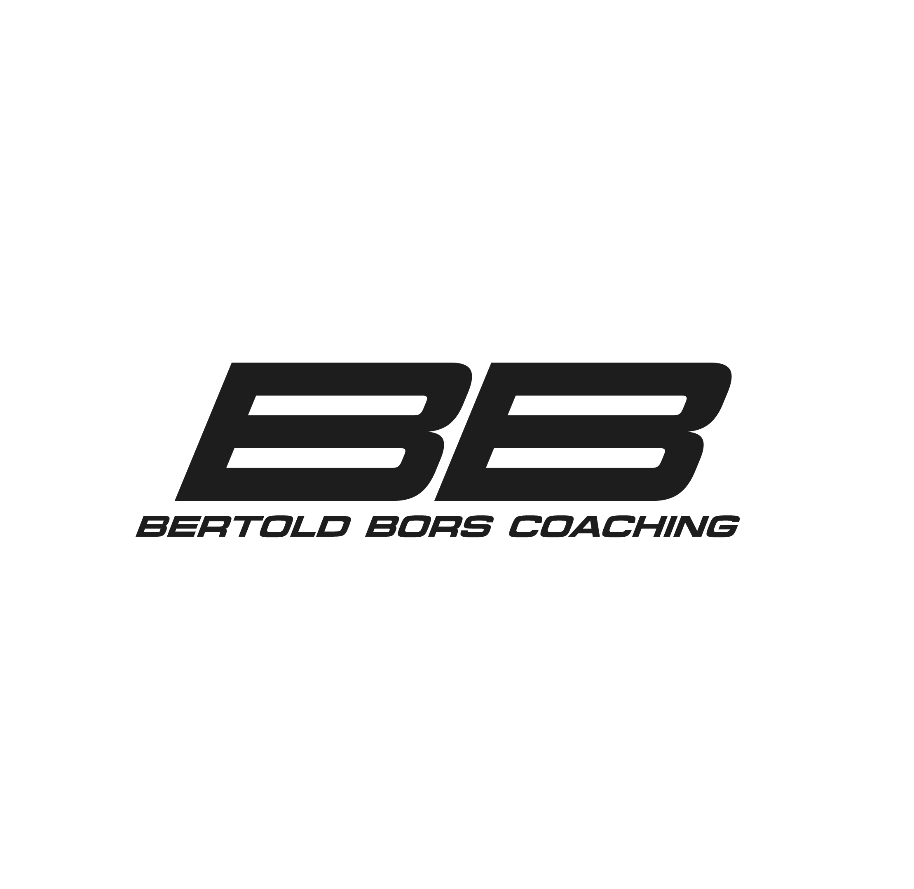

<div align="center">
  <a href="https://bertoldbors.com">
    
  </a>

  <h3 align="center">BB Coaching</h3>

  <p align="center">
    Professional Motorsport Coaching & Performance Analysis
    <br />
    <a href="https://bertoldbors.com"><strong>Visit Website »</strong></a>
    <br />
    <br />
    <a href="https://bertoldbors.com">View Demo</a>
    ·
    <a href="https://github.com/dkisb/BBCoaching/issues">Report Bug</a>
    ·
    <a href="https://github.com/dkisb/BBCoaching/issues">Request Feature</a>
  </p>
</div>

## About The Project

[![BB Coaching Screenshot][product-screenshot]](https://bertoldbors.com)

BB Coaching is a professional motorsport coaching platform founded by Bertold Bors, a motorsport performance analyst and driver development coach. The platform helps racing drivers reach their full potential through telemetry analysis, race data insights, and real-world racing experience.

### Key Features:
* **Performance Analysis** - Data-driven coaching to improve lap times and consistency
* **Vehicle Setup** - Expert guidance on suspension, tire pressures, and car configuration
* **Mental Training** - Techniques to manage pressure and maintain focus
* **Multilingual Support** - Available in English and Hungarian
* **Interactive Gallery** - Showcase of racing achievements and experiences
* **Testimonials** - Real feedback from coached drivers and clients

### Built With

This project is built using modern web technologies for optimal performance and user experience:

* [![Next][Next.js]][Next-url]
* [![React][React.js]][React-url]
* [![TypeScript][TypeScript]][TypeScript-url]
* [![TailwindCSS][TailwindCSS]][Tailwind-url]

## Getting Started

To get a local copy up and running, follow these simple steps.

### Prerequisites

Make sure you have the following installed:
* Node.js (v20 or higher)
* pnpm
  ```sh
  npm install -g pnpm
  ```

### Installation

1. Clone the repo
   ```sh
   git clone https://github.com/yourusername/BBCoaching.git
   ```
2. Navigate to the project directory
   ```sh
   cd BBCoaching
   ```
3. Install dependencies
   ```sh
   pnpm install
   ```
4. Create a `.env.local` file in the root directory and add your environment variables
   ```env
   RESEND_API_KEY=your_resend_api_key
   ```
5. Run the development server
   ```sh
   pnpm dev
   ```
6. Open [http://localhost:3000](http://localhost:3000) in your browser

## Usage

The BB Coaching website provides a comprehensive platform for motorsport coaching services:

### For Visitors:
- Browse coaching services and expertise areas
- View testimonials from previous clients
- Explore the gallery of racing achievements
- Contact Bertold directly through the contact form
- Switch between English and Hungarian languages

### For Developers:
- The project uses Next.js 15 with the App Router
- Internationalization is handled via `next-intl`
- Animations are powered by AOS (Animate On Scroll)
- Contact form submissions use Resend for email delivery
- Responsive design with mobile-first approach

## Roadmap

- [x] Multi-language support (EN/HU)
- [x] Contact form with email integration
- [x] Responsive design
- [x] Gallery carousel
- [x] Testimonials section
- [x] Online booking system
- [ ] Blog section for racing insights
- [ ] Driver performance dashboard
- [ ] Video analysis tools

See the [open issues](https://github.com/yourusername/BBCoaching/issues) for a full list of proposed features (and known issues).

## Contributing

Contributions are what make the open source community such an amazing place to learn, inspire, and create. Any contributions you make are **greatly appreciated**.

If you have a suggestion that would make this better, please fork the repo and create a pull request. You can also simply open an issue with the tag "enhancement".
Don't forget to give the project a star! Thanks again!

1. Fork the Project
2. Create your Feature Branch (`git checkout -b feature/AmazingFeature`)
3. Commit your Changes (`git commit -m 'Add some AmazingFeature'`)
4. Push to the Branch (`git push origin feature/AmazingFeature`)
5. Open a Pull Request

## License

Distributed under a proprietary license. All rights reserved by BB Coaching.

## Contact

Bertold Bors - [@bbcoaching](https://bertoldbors.com) - bors.bertold@gmail.com

Project Link: [https://github.com/dkisb/BBCoaching](https://github.com/dkisb/BBCoaching)

## Acknowledgments

* [Next.js Documentation](https://nextjs.org/docs)
* [next-intl](https://next-intl-docs.vercel.app/)
* [AOS - Animate On Scroll](https://michalsnik.github.io/aos/)
* [React Icons](https://react-icons.github.io/react-icons/)
* [Resend](https://resend.com/)
* [Vercel Analytics](https://vercel.com/analytics)
* [Best-README-Template](https://github.com/othneildrew/Best-README-Template)

<!-- MARKDOWN LINKS & IMAGES -->
[product-screenshot]: public/images/about.jpg
[Next.js]: https://img.shields.io/badge/next.js-000000?style=for-the-badge&logo=nextdotjs&logoColor=white
[Next-url]: https://nextjs.org/
[React.js]: https://img.shields.io/badge/React-20232A?style=for-the-badge&logo=react&logoColor=61DAFB
[React-url]: https://reactjs.org/
[TypeScript]: https://img.shields.io/badge/TypeScript-007ACC?style=for-the-badge&logo=typescript&logoColor=white
[TypeScript-url]: https://www.typescriptlang.org/
[TailwindCSS]: https://img.shields.io/badge/Tailwind_CSS-38B2AC?style=for-the-badge&logo=tailwind-css&logoColor=white
[Tailwind-url]: https://tailwindcss.com/

